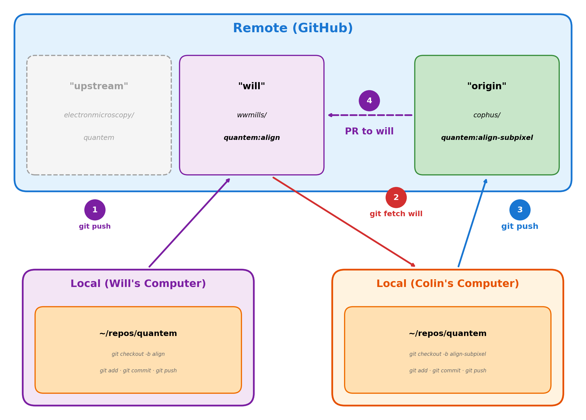
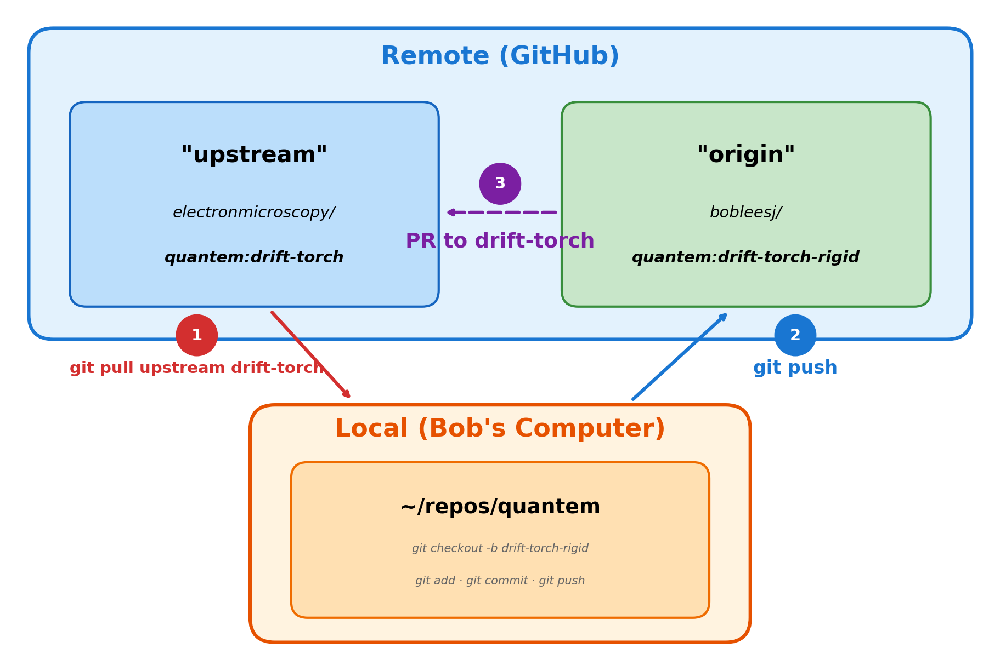
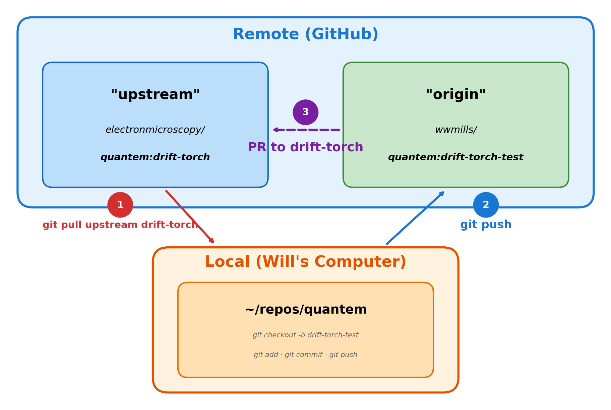

# Contributing to open source projects on GitHub

Welcome! This guide teaches you how to contribute to open source using a fork-based workflow. We use [quantem](https://github.com/electronmicroscopy/quantem) as an example, but these patterns work for any project. The goal: you'll never lose work, your collaborators will always know what you're doing, and your code history will tell a coherent story.

If you have any questions or find instructions unclear, reach out to @bobleesj.

## Quick start

| Case | When to use | PR target |
|------|-------------|-----------|
| [1](#case-1-prototyping-on-your-fork) | Initial/private algorithm; colleague wants to test and contribute | `<username>/quantem:<branch>` |
| [2](#case-2-major-feature-development) | Large features, multi-person collaboration | `electronmicroscopy/quantem:<branch>` |
| [3](#case-3-quick-fixes-typos-small-bugs-small-features) | Typos, small bugs, documentation | `electronmicroscopy/quantem:dev` |

## Table of contents

1. [How do I set up my computer?](#how-do-i-set-up-my-computer-5-10-minutes)
2. [Making your first contribution](#making-your-first-contribution)
3. [GitHub issues and pull requests](#github-issues-and-pull-requests)
4. [Troubleshooting](#troubleshooting)
5. [Appendix A: Glossary](#appendix-a-glossary)
6. [Appendix B: Acronyms](#appendix-b-acronyms)
7. [Appendix C: SSH for GitHub](#appendix-c-ssh-for-github)

Before contributing, make sure you:

- [ ] Review the naming philosophy behind clone, fork, origin, upstream, fetch, merge, and pull (see [Appendix A](#appendix-a-glossary)).

## How do I set up my computer? (5-10 minutes)

### One-time computer setup

1. Install Git: https://git-scm.com/
2. Windows user? Install Git Bash: https://gitforwindows.org/
3. Set up SSH for GitHub so you don't have to enter your password every time (see [Appendix C](#appendix-c-ssh-for-github)).
4. Install GitHub CLI: https://cli.github.com/

#### Fork setup

1. Go to [https://github.com/electronmicroscopy/quantem](https://github.com/electronmicroscopy/quantem) and click **Fork**.
2. Clone your fork:
   ```bash
   git clone https://github.com/<your-username>/quantem.git
   cd quantem
   ```
3. Add the upstream remote:
   ```bash
   git remote add upstream https://github.com/electronmicroscopy/quantem.git
   ```
4. Verify remotes with `git remote -v`. You should see both `origin` (your fork) and `upstream` (the org repo).

#### Development environment setup

For installing `quantem` in development mode with `uv`, setting up pre-commit hooks, and managing dependencies, see the [quantem CONTRIBUTORS.md](https://github.com/electronmicroscopy/quantem/blob/dev/CONTRIBUTORS.md).

## Making your first contribution

There are three common cases when contributing to `quantem`:

- **Case 1:** [Prototyping on your fork](#case-1-prototyping-on-your-fork) - initial/private algorithm development; colleague helps test
- **Case 2:** [Major feature development](#case-2-major-feature-development) - larger features requiring collaboration on upstream
- **Case 3:** [Quick fixes](#case-3-quick-fixes-typos-small-bugs-small-features) - typos, small bugs, small features, documentation updates

### Case 1: Prototyping on your fork

Assume Will is prototyping a new alignment algorithm on his personal fork. The code isn't ready for the main repository yet, but Will asks Colin for help testing and improving it.

Here's an overview—follow the steps below first, then use this diagram as a reference:



#### Will starts the prototype

1. Will checks out his local `dev` branch and pulls the latest from upstream (after cloning, the local `dev` branch has the same commit history as the `dev` branch on his fork):
   ```bash
   git checkout dev
   git pull upstream dev
   ```
2. Will creates a local branch off of the latest commits from `dev`:
   ```bash
   git checkout -b align
   ```
3. Will makes changes, commits, and uploads the local branch to his fork:
   ```bash
   git add <files>
   git commit -m "Add initial alignment algorithm"
   git push -u origin align
   ```
   > **Note:** The `-u` flag sets upstream tracking. You only need it the first time you push a new branch. After that, `git push` is sufficient.

Will continues iterating on `wwmills/quantem:align`. Now Colin wants to contribute and test Will's code. How does Colin contribute?

#### Colin joins to help

1. Colin adds Will's fork URL so he can fetch Will's latest commits:
   ```bash
   git remote add will https://github.com/wwmills/quantem.git
   ```
2. Colin fetches Will's commits and checks out Will's branch:
   ```bash
   git fetch will
   git checkout will/align
   ```
3. Colin creates a local branch off of Will's `align` branch:
   ```bash
   git checkout -b align-subpixel
   ```
4. Colin makes changes and commits:
   ```bash
   git add <files>
   git commit -m "Add subpixel alignment support"
   ```
5. Colin uploads his local `align-subpixel` branch to Colin's fork (`https://github.com/cophus/quantem`):
   ```bash
   git push -u origin align-subpixel
   ```
6. Colin visits `https://github.com/wwmills/quantem` and clicks the green **Compare & pull request** button to create a PR from `cophus/quantem:align-subpixel` to `wwmills/quantem:align`. Colin follows the guidelines in [Making the pull request review process effective](#making-the-pull-request-review-process-effective).

#### What happens next?

1. Will reviews and merges Colin's PR into `wwmills/quantem:align`.
2. When the feature is ready, Will creates a PR from `wwmills/quantem:align` to `electronmicroscopy/quantem:dev`.
3. A maintainer reviews and merges it. Colin's commits are preserved in the contribution history.

> **Note:** If the PR to `quantem/dev` would be too large (e.g., thousands of lines), consider using [Case 2](#case-2-major-feature-development) instead. We don't want to overwhelm core reviewers with massive PRs. Case 2 creates a feature branch on upstream where multiple people can contribute iteratively with smaller, reviewable PRs before merging to `quantem/dev`.

### Case 2: Major feature development

Here we use the example of Bob. Bob is building drift correction for `quantem` using PyTorch to speed up computation. This is an actual workflow Bob uses to collaborate with Will. The feature is too large for a single PR and requires multiple iterations before it's ready for `quantem/dev`. How does Bob collaborate with Will so they can build and contribute collectively?

Here's an overview—follow the steps below first, then use this diagram as a reference:



#### Creating the branch on upstream (maintainer)

1. Go to [https://github.com/electronmicroscopy/quantem](https://github.com/electronmicroscopy/quantem).
2. Click the branch dropdown (shows `quantem/dev`), type the new branch name (e.g., `drift-torch`), and click **Create branch: drift-torch from quantem/dev**.

#### Contributing to the branch

When multiple people contribute to a branch on upstream, each person creates local branches and PRs iteratively.

1. Bob fetches the branch and pulls the latest:
   ```bash
   git fetch upstream
   git checkout drift-torch
   git pull upstream drift-torch
   ```
2. Bob creates a branch named after the specific feature:
   ```bash
   git checkout -b drift-torch-rigid
   ```
3. Bob makes changes and commits:
   ```bash
   git add <files>
   git commit -m "Add rigid transformation for drift correction"
   ```
4. Bob uploads his local `drift-torch-rigid` branch to his fork (origin):
   ```bash
   git push -u origin drift-torch-rigid
   ```
5. Bob visits [https://github.com/electronmicroscopy/quantem](https://github.com/electronmicroscopy/quantem) and clicks the green **Compare & pull request** button to create a PR from `bobleesj/quantem:drift-torch-rigid` to `electronmicroscopy/quantem:drift-torch` (not `dev`). Bob follows the guidelines in [Making the pull request review process effective](#making-the-pull-request-review-process-effective).

For Bob's next contribution, Bob does not branch off from `drift-torch-rigid`. Instead, Bob starts from the latest `upstream/drift-torch` branch—it is the source of truth and contains merged commits from all contributors:

1. Bob switches to the branch and pulls the latest:
   ```bash
   git checkout drift-torch
   git pull upstream drift-torch
   ```
2. Bob creates a new branch for the next feature:
   ```bash
   git checkout -b drift-torch-affine
   ```
3. Bob makes changes, commits, and uploads his local `drift-torch-affine` branch to his fork:
   ```bash
   git add <files>
   git commit -m "Add affine transformation for drift correction"
   git push -u origin drift-torch-affine
   ```
4. Bob visits [https://github.com/electronmicroscopy/quantem](https://github.com/electronmicroscopy/quantem) and clicks the green **Compare & pull request** button to create a PR from `bobleesj/quantem:drift-torch-affine` to `electronmicroscopy/quantem:drift-torch`. Bob follows the guidelines in [Making the pull request review process effective](#making-the-pull-request-review-process-effective).

#### Another contributor joins (Will)



Will wants to contribute to the same branch. Will sees `drift-torch`, which contains the latest commits merged from `drift-torch-rigid` and `drift-torch-affine`. Will has experimental data and tests the code across multiple dimensions, debugging and fixing issues from previous commits:

1. Will fetches the branch and pulls the latest:
   ```bash
   git fetch upstream
   git checkout drift-torch
   git pull upstream drift-torch
   ```
2. Will creates a branch for adding tests:
   ```bash
   git checkout -b drift-torch-test
   ```
3. Will makes changes, commits, and uploads his local `drift-torch-test` branch to his fork:
   ```bash
   git add <files>
   git commit -m "Add unit tests for drift correction"
   git push -u origin drift-torch-test
   ```
4. Will visits [https://github.com/electronmicroscopy/quantem](https://github.com/electronmicroscopy/quantem) and clicks the green **Compare & pull request** button to create a PR from `wwmills/quantem:drift-torch-test` to `electronmicroscopy/quantem:drift-torch`. Will follows the guidelines in [Making the pull request review process effective](#making-the-pull-request-review-process-effective).

Will continues with `drift-torch-validate`, `drift-torch-large-images`, etc. Both Bob and Will can contribute simultaneously—the feature-based naming (`-rigid`, `-test`, `-validate`) keeps everyone's work organized and descriptive.

> **Tip:** To avoid merge conflicts, communicate with your team before starting work. Ideally, two people should not edit the same file at the same time. A quick message ("I'm working on `drift.py`") helps prevent conflicts.

When the feature is complete and tested, either Bob or Will can create a PR from `electronmicroscopy/quantem:drift-torch` to `electronmicroscopy/quantem:dev` following the [pull request guidelines](#making-the-pull-request-review-process-effective). A maintainer reviews and merges it.

### Case 3: Quick fixes (typos, small bugs, small features)

You spotted a typo in the README. The fix is small enough that it can go directly to `quantem/dev` as a single PR. How do you contribute it?

Here's an overview—follow the steps below first, then use this diagram as a reference:


1. Switch to your local `dev` branch (it already exists after cloning) and pull the latest commits from `upstream/dev`:
   ```bash
   git checkout dev
   git pull upstream dev
   ```
2. Create a local branch called `fix-readme-typo`:
   ```bash
   git checkout -b fix-readme-typo
   ```
3. Edit `README.md` using your favorite IDE.
4. Stage and commit the changes:
   ```bash
   git add README.md
   git commit -m "Fix typo in README installation section"
   ```
5. Upload your local `fix-readme-typo` branch to your fork (origin):
   ```bash
   git push -u origin fix-readme-typo
   ```
6. Verify the branch exists on GitHub by visiting `https://github.com/<your-username>/quantem/tree/fix-readme-typo`.
7. Go to [https://github.com/electronmicroscopy/quantem](https://github.com/electronmicroscopy/quantem) and click the green **Compare & pull request** button to create a PR from `<your-username>/quantem:fix-readme-typo` to `electronmicroscopy/quantem:dev`. Follow the guidelines in [Making the pull request review process effective](#making-the-pull-request-review-process-effective).

## GitHub issues and pull requests

### Using GitHub issues

Use GitHub issues to report problems or propose new features. Unlike Slack, issues have a permanent URL that can be shared, linked, and accessed by the global community. Tag people with `@username` to send direct notifications.

An issue can be divided into two sections:

```
### What is the problem?

[Describe the problem or feature request]

### What are proposed solutions?

[Describe possible approaches]
```

Attach screenshots, error messages, and metadata (Python version, OS, package versions) as needed to help with debugging.

Examples:

- [Issue #136](https://github.com/electronmicroscopy/quantem/issues/136) - bug report (Python 3.13 type alias compatibility)
- [Issue #138](https://github.com/electronmicroscopy/quantem/issues/138) - feature request (`quantem.__version__` support)
- [Issue #105](https://github.com/electronmicroscopy/quantem/issues/105) - architecture discussion (whether to add Widget module)

### Making the pull request review process effective

When a PR addresses an issue, use `Closes #<issue-number>` in the PR body. Once merged, the issue will automatically close (see [PR #151](https://github.com/electronmicroscopy/quantem/pull/151)).

1. Start as a **Draft PR** while work is in progress.
2. Write a short, descriptive title that matches the branch name. Examples:
   - `` `quantem.widget` `Show4DSTEM` george v2 ophus v1 `` (branch: `quantem.widget-drift-george-v2-ophus-v1`)
   - `` `Dataset5dstem` - stack reduction, slicing, match `Dataset4dstem` API ``
3. In the body, cover two things: what the PR does and what the reviewer should do. Example:

    ```
    ### What does this PR do?

    Closes #<issue-number>

    [Describe the problem this PR solves. Focus on inputs/outputs.
    For new features, show the API design (function signatures, class interfaces).]

    ### What should the reviewer do?

    [Explain how to test, what to look for, or any dependencies on other PRs]
    ```

  > **Note:** Writing represents our internal state as the author. The goal is to externalize our reasoning so the team can make decisions collectively. We write as little as required, but as much as needed—a PR is self-serving documentation for developers and debugging along with commits. Reviewing takes time, and writing effectively respects the reviewer's time so we can prioritize advancing science.

4. Before tagging a reviewer, go to **Files changed** and review our own code. We'll catch mistakes and save everyone time. When ready, tag the reviewer and say "Ready for review."
5. After receiving feedback, optionally turn the reviewer's comments into a checklist and check off items as you address them. This respects the reviewer's input, acknowledges their feedback, and serves as a to-do list for everyone. If the list is too long or beyond scope, turn it into a GitHub issue for later tracking. After making changes, tag the reviewer again with "Ready for review." See [PR #146](https://github.com/electronmicroscopy/quantem/pull/146) for an example where George and Colin provided design feedback, and [this comment](https://github.com/electronmicroscopy/quantem/pull/146#issuecomment-3765590613) for an example checklist.

Examples:
- [PR #146](https://github.com/electronmicroscopy/quantem/pull/146) - visual/UI focused (widget, screenshots)
- [PR #151](https://github.com/electronmicroscopy/quantem/pull/151) - data structure/API design focused

### Guidelines

**We align on priorities first.** Before taking on a large PR, we address the feature or issue during our weekly Zoom quantem meeting or create a GitHub issue to ensure consensus on the approach.

**We focus on the code, not the person.** We keep feedback constructive and stay neutral in PRs and issues.

**We are here to contribute.** We provide constructive feedback to help each other improve.

**We stay accountable and responsive.** Due to the sequential nature of commits, fast iteration is often better. We communicate expected review times and use GitHub's design to keep things moving.

**We maintain balanced code quality.** We follow [NumPy docstring conventions](https://numpydoc.readthedocs.io/en/latest/format.html) and [PEP 8](https://peps.python.org/pep-0008/) standards, and provide example notebooks and tests where necessary.

**We ship, but not broken code.** Prototype freely in your fork or a branch on upstream. Unoptimized code is fine—broken code stays in the fork until it's fixed.

### Using GitHub CLI

GitHub CLI (`gh`) provides shortcuts for common tasks. See [GitHub CLI installation](https://cli.github.com/) if not already installed.

#### How do I check out someone else's pull request?

List open pull requests:

```bash
gh pr list
```

Check out a specific PR by number:

```bash
gh pr checkout 146
```

This creates a local branch with the PR's changes so you can test or review the code.

#### How do I view issues?

List open issues:

```bash
gh issue list
```

View a specific issue:

```bash
gh issue view 42
```

---

## Troubleshooting

<details>
<summary>I accidentally committed to dev instead of a new branch</summary>

If you haven't pushed yet:

```bash
git reset --soft HEAD~1
```

This undoes the commit but keeps your changes staged. Then create your new branch and recommit:

```bash
git checkout -b my-feature
git commit -m "Your message"
```

If you already pushed to your fork's `dev`, you'll need to reset it:

```bash
git checkout dev
git reset --hard upstream/dev
git push origin dev --force
```

Then create your new branch and recommit your changes.

</details>

<details>
<summary>I have merge conflicts</summary>

Merge conflicts happen when two people edit the same lines. Git marks conflicts like this:

```
<<<<<<< HEAD
your changes
=======
their changes
>>>>>>> branch-name
```

To resolve:

1. Open the conflicted file and look for `<<<<<<<` markers.
2. Decide which version to keep (or combine both).
3. Remove the conflict markers (`<<<<<<<`, `=======`, `>>>>>>>`).
4. Stage and commit:

   ```bash
   git add <file>
   git commit -m "Resolve merge conflict in <file>"
   ```

**Prevention tip:** Communicate with your team. If two people need to edit the same file, coordinate timing or split the work into different sections.

</details>

<details>
<summary>I made changes but Git says "nothing to commit"</summary>

Common causes:

1. **You're in the wrong directory.** Run `pwd` and make sure you're inside the repository.
2. **Changes aren't saved.** Save your files in your editor.
3. **Files are gitignored.** Check `.gitignore` to see if your file pattern is excluded.
4. **You already committed.** Run `git log` to see recent commits.

</details>

<details>
<summary>I want to undo my last commit</summary>

If you haven't pushed yet:

```bash
git reset HEAD~1 --soft    # Keeps changes staged
git reset HEAD~1 --mixed   # Keeps changes unstaged (default)
git reset HEAD~1 --hard    # Discards changes entirely (careful!)
```

If you already pushed, it's safer to make a new commit that reverses the changes:

```bash
git revert HEAD            # Creates a new commit undoing the last one
git push origin <branch>
```

</details>

<details>
<summary>Git says "Your branch is behind" when I try to push</summary>

The upstream branch has new commits. Pull the latest first:

```bash
git pull upstream <branch>
```

If there are conflicts, resolve them (see merge conflicts above), then push.

</details>

---

## Appendix A: Glossary

<details>
<summary>What is the difference between <b>remote</b> and <b>local</b>?</summary>

**Remote** is a repository hosted on GitHub (under your account or an organization). **Local** is the copy on your computer.

Example: `https://github.com/electronmicroscopy/quantem` is remote. The folder on your computer after `git clone` is local.
</details>

<details>
<summary>What is the difference between <b>fork</b> and <b>clone</b>?</summary>

**Fork** creates a personal copy on GitHub under your account. **Clone** downloads a repository to your local machine.

Example: Clicking "Fork" on GitHub creates `https://github.com/bobleesj/quantem`. Running `git clone` downloads it to your computer.
</details>

<details>
<summary>What is the difference between <b>origin</b> and <b>upstream</b>?</summary>

**Origin** points to your fork. **Upstream** points to the original repository.

Example: `origin` = `https://github.com/bobleesj/quantem`. `upstream` = `https://github.com/electronmicroscopy/quantem`.
</details>

<details>
<summary>What is the difference between <b>branch</b> and <b>fork</b>?</summary>

A **branch** is a parallel version of code within the same repository. A **fork** is a copy of the entire repository under a different account.

Example: `quantem/dev` and `quantem/drift` are branches. `electronmicroscopy/quantem` and `bobleesj/quantem` are forks.
</details>

<details>
<summary>What is the difference between <b>pull</b> and <b>fetch</b>?</summary>

**Fetch** downloads changes from a remote but doesn't apply them. **Pull** fetches and merges the changes into your current branch.

Example: `git fetch upstream` downloads updates. `git pull upstream dev` downloads and merges into your local `dev`.
</details>

<details>
<summary>What is the difference between <b>git add</b> and <b>git commit</b>?</summary>

**git add** stages changes (prepares them to be committed). **git commit** saves the staged changes to your local repository.

Example: `git add file.py` stages the file. `git commit -m "Add feature"` saves it with a message.
</details>

<details>
<summary>What is the difference between <b>git pull</b> and <b>git push</b>?</summary>

**git pull** downloads changes from a remote and merges them into your local branch. **git push** uploads your local commits to a remote.

Example: `git pull upstream dev` gets updates from upstream. `git push origin fix-typo` sends your commits to your fork.
</details>

<details>
<summary>What is a <b>PR (pull request)</b>?</summary>

A request to merge your changes from one branch into another.

Example: PR from `bobleesj/quantem:fix-typo` to `electronmicroscopy/quantem:dev`.
</details>

<details>
<summary>What is <b>detached HEAD</b> state?</summary>

When you check out a remote-tracking branch directly (like `will/align`), Git puts you in "detached HEAD" state. This means you're not on a local branch—you're viewing a snapshot of the remote.

Example from [Case 1](#case-1-prototyping-on-your-fork): When Colin runs `git checkout will/align`, he's in detached HEAD state. Any commits made here won't belong to a branch and could be lost. That's why Colin creates a local branch with `git checkout -b align-subpixel`—this saves his work to a proper branch.

</details>

<details>
<summary>How do I temporarily save uncommitted changes (<b>git stash</b>)?</summary>

When you have uncommitted changes and need to switch branches, Git will block you to prevent losing your work. Use `git stash` to temporarily save your changes, switch branches, and then restore them later with `git stash pop`.

```bash
git stash           # Save uncommitted changes
git checkout dev    # Switch to another branch
# ... do other work ...
git checkout my-branch
git stash pop       # Restore your saved changes
```

</details>

## Appendix B: Acronyms

- **PR** - Pull Request
- **SSH** - Secure Shell
- **CLI** - Command Line Interface (e.g., Terminal, Warp, Git Bash)
- **IDE** - Integrated Development Environment (e.g., VS Code, PyCharm)
- **API** - Application Programming Interface
- **UI** - User Interface
- **UX** - User Experience
- **GUI** - Graphical User Interface
- **CI/CD** - Continuous Integration / Continuous Deployment (automated testing and deployment in the cloud, e.g., GitHub Actions)

## Appendix C: SSH for GitHub

SSH allows you to push and pull without entering your password every time.

In your terminal, run the following commands to generate a new SSH key pair. Replace `<email@example.com>` with your email address.

```bash
mkdir -p ~/.ssh
cd ~/.ssh
ssh-keygen -o -t rsa -C "<email@example.com>"
cat id_rsa.pub
```

1. Visit https://github.com/settings/keys.
2. Click **New SSH key**.
3. Set the Title as `<your-computer-name>-key`.
4. Under Key, copy and paste the content of the `id_rsa.pub` file. It should start with `ssh-rsa` and end with your email address.
5. Click **Add SSH key**.
6. Done!
